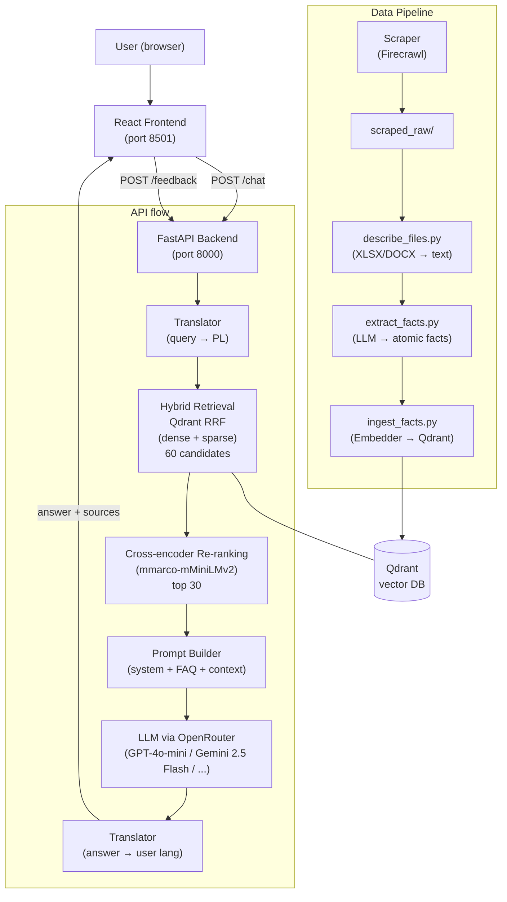

# MiNIonek — RAG Chatbot for Faculty of MiNI PW

A multilingual RAG-based chatbot for the Faculty of Mathematics and Information Science (MiNI) at Warsaw University of Technology. Answers student and staff questions about schedules, regulations, events, administrative procedures, and more.

**Languages supported:** Polish, English, Ukrainian

---

## System Architecture



**Data flow (query):**
1. User query → Frontend
2. API translates non-Polish queries to Polish
3. Hybrid retrieval: dense (sentence-transformers) + sparse (BM25) → RRF fusion in Qdrant → 60 candidates
4. Cross-encoder re-ranking (`mmarco-mMiniLMv2`) selects top 30 facts
5. Top-30 facts passed to prompt builder alongside conversation history and static FAQ
6. LLM generates a Polish answer via OpenRouter
7. Answer translated back to user's language if needed
7. Response + source URLs returned to frontend

**Data flow (ingestion):**
1. Firecrawl scrapes MiNI PW website (HTML + PDF)
2. XLSX/DOCX files processed by `describe_files.py`
3. LLM extracts atomic facts from each document
4. Facts embedded and stored in Qdrant with source URL metadata

---

## Repository Structure

```
Chatbot-MiNI/
├── src/
│   ├── api/                        # FastAPI server + query pipeline
│   │   ├── api.py                  # /chat, /feedback, /experiment-config endpoints
│   │   ├── main.py                 # OpenRouter LLM client
│   │   ├── models.py               # Pydantic models (Message)
│   │   ├── retrieval.py            # Hybrid Qdrant retrieval (dense+sparse RRF) + cross-encoder re-ranking
│   │   ├── prompt_builder.py       # LLM prompt construction + per-role hints
│   │   ├── query_rewriter.py       # LLM-based query rewriting before retrieval
│   │   ├── translator.py           # Multi-language translation (PL/EN/UA)
│   │   ├── logs.py                 # Logging utilities
│   │   └── tests/
│   │       ├── api_test.py         # /chat, /feedback endpoint tests
│   │       └── main_test.py        # OpenRouter client tests
│   │
│   ├── ingestion/                  # Everything that builds the knowledge base
│   │   ├── common.py               # Pipeline version config (v1-v4), LLM client
│   │   ├── scraper.py              # Firecrawl-based web scraper (saves incrementally)
│   │   ├── describe_files.py       # XLSX/DOCX text extraction
│   │   ├── extract_facts.py        # LLM-based fact extraction (all facts, no selection)
│   │   ├── ingest_facts.py         # Embed facts + load into Qdrant (batched, resumable)
│   │   ├── ingest_manual_pdfs.py   # Convert manually downloaded PDFs → scraped_raw .txt
│   │   ├── progress.py             # Pipeline progress tracker (scraped/extracted/ingested)
│   │   ├── links_curated.py        # ~15 hand-picked URLs (v1–v2)
│   │   ├── links_extended.py       # Full URL list for MiNI PW website (v3+)
│   │   ├── embedder.py             # HuggingFace embedding wrapper (BAAI/bge-m3)
│   │   ├── vector_db.py            # Qdrant collection setup + write/read helpers
│   │   └── tests/
│   │       ├── scraper_test.py         # clean_headnote, clean_footnote, main()
│   │       ├── extract_facts_test.py   # placeholder
│   │       ├── ingest_facts_test.py    # placeholder
│   │       ├── describe_files_test.py  # placeholder
│   │       └── common_test.py          # placeholder
│   │
│   ├── manual_pdfs/                # Manually downloaded PDFs (git-tracked, BIP PW cookiewall)
│   │   ├── regulamin_studiow.pdf
│   │   ├── regulamin_swiadczen_2025_2026.pdf
│   │   └── *.pdf                   # 18 hash-named BIP PW documents
│   │
│   ├── evaluation/                 # All evaluation and benchmarking
│   │   ├── benchmark.py            # Main benchmark (Hit@k, cch@k, MRR, MRRw, nDCG, MAP, P-R)
│   │   ├── benchmark_v1.py         # Legacy simple benchmark
│   │   ├── generate_golden_answers.py  # Golden answers from 3 supermodels (GPT-5.5, Opus 4.7, Gemini 3.1)
│   │   ├── weighted_feedback.py    # Weighted aggregation of user feedback by role
│   │   ├── metrics.py              # BERTScore text metrics
│   │   ├── prepare_data.py         # CSV utilities for evaluation data
│   │   ├── eval_with_playwright.py # Playwright-based UI automation for answer collection
│   │   ├── llm_judge/
│   │   │   ├── judge.py            # LLM-as-a-judge A/B (1-5 scales: usefulness/accuracy/conciseness)
│   │   │   ├── testpro_runner.py   # Batch A/B runner — controlled by EXPERIMENT_DIM env var
│   │   │   ├── golden_judge.py     # LLM-as-a-judge: chatbot vs golden (asymmetric + symmetric prompts)
│   │   │   ├── golden_judge_runner.py  # Batch runner: chatbot vs golden answers WITHOUT context
│   │   │   └── context_golden_runner.py  # Batch runner: chatbot vs golden answers WITH full context
│   │   ├── tests/
│   │   │   └── evaluation_test.py  # BERTScore metrics tests
│   │   ├── benchmark_checks/           # Ablation + coverage analysis scripts
│   │   │   ├── check_coverage.py       # Are gold benchmark URLs in Qdrant?
│   │   │   ├── check_rewriter.py       # Ablation: query rewriter ON vs OFF
│   │   │   └── check_reranker.py       # Ablation: cross-encoder reranker ON vs OFF
│   │   └── data/
│   │       ├── questions.csv           # Raw student survey questions
│   │       ├── questions_cat.csv       # Questions with category labels
│   │       ├── questions_filtered.csv  # Filtered eval set with gold URLs
│   │       ├── questions_with_links.csv # Full eval set with source links
│   │       ├── golden_answers.csv      # Reference answers from 3 supermodels (no context)
│   │       └── context_golden_answers.csv  # Reference answers from supermodel WITH full context (LM Notebooks)
│   │
│   ├── frontend/                   # React/Vite frontend
│   │   ├── src/
│   │   │   ├── App.jsx             # Main app (chat UI, A/B testing, role selection, feedback)
│   │   │   └── App.css
│   │   ├── vite.config.js          # Dev + preview proxy → api:8000 (Docker)
│   │   ├── Dockerfile
│   │   └── package.json
│   │
│   └── utils/
│       └── paths.py                # Path utilities
│
├── .github/workflows/
│   ├── deploy.yml                  # Manual deploy to self-hosted runner (run this first!)
│   ├── scrape_and_ingest.yml       # Manual: run scraper then full ingest pipeline
│   ├── ingest_only.yml             # Manual: run ingest only (skip scraping)
│   ├── tests.yml                   # Manual: run test suite (workflow_dispatch only)
│   ├── check_coverage.yml          # Ablation: how many gold URLs are in Qdrant?
│   ├── check_rewriter.yml          # Ablation: query rewriter ON vs OFF
│   └── check_reranker.yml          # Ablation: cross-encoder reranker ON vs OFF
│
├── docker-compose.yml              # 5 services: scraper, ingest, api, frontend, tests
├── Dockerfile                      # Micromamba-based Python image
├── DEPLOYMENT.md                   # Step-by-step deployment & ingestion instructions
├── environment-linux.yml           # Conda env for Linux (deployment)
└── chatbot_mini.yml                # Conda env for Windows/Mac (local dev)
```

**Pipeline versions** (set via `PIPELINE_VERSION` env var):

| Version | URLs | Files | Chunking | LLM |
|---------|------|-------|----------|-----|
| 1 | 15 hand-picked | HTML + PDF | 1 file = 1 chunk | No |
| 2 | 15 hand-picked | HTML + PDF | 1 fact = 1 chunk | Yes |
| 3 | Full MiNI website | All (incl. XLSX/DOCX) | 1 fact = 1 chunk | Yes |
| 4 | All sources | All | 1 fact = 1 chunk | Yes |

---

## Local Setup

### Prerequisites

- [Conda](https://docs.conda.io/en/latest/) or [Miniconda](https://docs.conda.io/en/latest/miniconda.html)
- A `.env` file in the project root (see below)

### 1. Clone and create environment

```bash
git clone https://github.com/<your-fork>/Chatbot-MiNI
cd Chatbot-MiNI

# Windows / Mac
conda env create -f chatbot_mini.yml
conda activate chatbot_mini

# Linux
conda env create -f environment-linux.yml
conda activate chatbot_mini
```

### 2. Create `.env` file

```env
OPENROUTER_API_KEY=sk-or-...
FIRECRAWL_API_KEY=fc-...
PIPELINE_VERSION=2
MODEL_NAME=openai/gpt-4o-mini
QDRANT_DIR=src/data/qdrant_db

# A/B experiment dimension — what varies between variant A and B in Test/TestPro mode
# Options: model | temperature | persona
EXPERIMENT_DIM=model
EXPERIMENT_MODEL=openai/gpt-4o-mini   # baseline model (used when dim=temperature or persona)
EXPERIMENT_TEMP=0.2                   # baseline temperature (used when dim=model or persona)
EXPERIMENT_PERSONA=3                  # baseline persona index 0-3 (used when dim=model or temperature)
```

Dostępne persony (`EXPERIMENT_PERSONA`):

| Indeks | Styl |
|---|---|
| 0 | Krótko i konkretnie |
| 1 | Luzno i przyjaźnie |
| 2 | Formalnie i akademicko |
| 3 | Wyczerpująco z detalami |

### 3. Run the ingestion pipeline (builds the vector DB)

```bash
# From repo root, with PYTHONPATH=src
export PYTHONPATH=src   # or set PYTHONPATH=src on Windows

python -m ingestion.scraper         # scrape pages → src/data/scraped_raw/
python -m ingestion.describe_files  # extract text from XLSX/DOCX (v3+)
python -m ingestion.extract_facts   # LLM fact extraction (v2+)
python -m ingestion.ingest_facts    # embed + load into Qdrant
```

For a quick local test with a small dataset, set `PIPELINE_VERSION=2` (15 URLs, fact-based).

### 4. Start the API

```bash
uvicorn api.api:app --reload --port 8000
```

### 5. Start the React frontend

```bash
cd src/frontend
npm install
npm run dev
# opens at http://localhost:5173
```

### 6. Or run everything with Docker Compose

```bash
docker compose up --build
```

---

## Running Evaluation

```bash
export PYTHONPATH=src  # Windows: $env:PYTHONPATH="src"

# Main benchmark (Hit@k, MRR, nDCG, MAP) — requires running Qdrant
python -m evaluation.benchmark

# Generate golden answers from 3 supermodels (no API/Qdrant needed)
python -m evaluation.generate_golden_answers           # all questions
python -m evaluation.generate_golden_answers --limit 10  # quick test
python -m evaluation.generate_golden_answers --resume    # resume after interruption

# A/B judge: compare two chatbot variants (controlled by EXPERIMENT_DIM in .env)
# Requires running API
python -m evaluation.llm_judge.testpro_runner \
  --judge-model anthropic/claude-opus-4.7 \
  --limit 50

# Golden judge: compare chatbot answer vs supermodel reference (no context)
# Requires running API + generated golden_answers.csv
python -m evaluation.llm_judge.golden_judge_runner \
  --judge-model anthropic/claude-opus-4.7 \
  --golden-model opus \
  --limit 50

# Context golden judge: compare chatbot vs supermodel WITH full context (LM Notebooks)
# Requires running API + context_golden_answers.csv
python -m evaluation.llm_judge.context_golden_runner \
  --judge-model anthropic/claude-opus-4.7 \
  --limit 50
```

Szczegóły wszystkich opcji: `src/evaluation/README.md`

---

## Evaluation Map — co i jak testujemy

Pełna mapa wszystkich zaimplementowanych metod ewaluacji.

### 1. Metryki retrieval (standardowe)

**Pytanie:** Czy system dobrze wyszukuje istotne dokumenty?

| Metryka | Opis | Plik |
|---|---|---|
| Hit@k | Czy gold URL trafił w top-k wynikach | `evaluation/benchmark.py` |
| **cch@k** | Hit@k liczony tylko dla pytań, których gold URL jest w Qdrant — eliminuje błędy scraping z metryki retrieval — **własna metryka** | `evaluation/benchmark.py` |
| MRR@k | Na której pozycji (średnio) pojawia się gold URL | `evaluation/benchmark.py` |
| **MRRw@k** | Jak MRR, ale z częściowym kredytem za parent/child URLe (0.5^depth) — **własna metryka** | `evaluation/benchmark.py` |
| nDCG@k | Jakość rankingu z ważeniem po pozycji | `evaluation/benchmark.py` |
| MAP@k | Średnia precyzja przez cały ranking | `evaluation/benchmark.py` |
| Precision-Recall curves | Krzywe P-R dla różnych k | `evaluation/benchmark.py` |
| coverage_rate | Procent pytań benchmarkowych z gold URL obecnym w Qdrant | `evaluation/benchmark.py` |

Uruchomienie:

```bash
python -m evaluation.benchmark                  # standardowe metryki
python -m evaluation.benchmark --check-coverage # +cch@k i coverage_rate
python -m evaluation.benchmark --no-rerank      # bez cross-encoder (RRF only)
```

(wymaga działającego Qdrant lub uruchomionego API z `--api-base-url`)

---

### 2. Porównanie modeli do ekstrakcji faktów

**Pytanie:** Czy inny LLM użyty do ekstrakcji faktów podczas ingestion daje lepsze wyniki retrieval?

| Co się zmienia | Jak zmierzyć | Gdzie |
|---|---|---|
| Model LLM w `extract_facts.py` | Reingest z nowym modelem → uruchom `benchmark.py` → porównaj metryki | `ingestion/extract_facts.py` + `evaluation/benchmark.py` |

Zmień model przez `MODEL_NAME` w `.env` i uruchom pełny pipeline ingestion ponownie.

---

### 3. Porównanie modeli embeddingów

**Pytanie:** Czy lepszy model embeddingów (np. BAAI/bge-m3 vs all-MiniLM-L6-v2) poprawia retrieval?

| Co się zmienia | Jak zmierzyć | Gdzie |
|---|---|---|
| Klasa embeddera w `embedder.py` | Reingest z nowym modelem → uruchom `benchmark.py` → porównaj metryki | `ingestion/embedder.py` + `evaluation/benchmark.py` |

---

### 4a. Golden Judge — chatbot vs supermodel BEZ kontekstu

**Pytanie:** Jak dobra jest odpowiedź chatbota (z RAG) względem tego, co powiedziałby frontier model z samej wiedzy parametrycznej?

| Co oceniamy | Metryki | Plik |
|---|---|---|
| Chatbot (RAG) vs GPT-5.5 | usefulness, accuracy, completeness (1–5) + który lepszy + dlaczego | `evaluation/llm_judge/golden_judge_runner.py` |
| Chatbot (RAG) vs Claude Opus 4.7 | j.w. | j.w. |
| Chatbot (RAG) vs Gemini 3.1 Pro | j.w. | j.w. |

Uwaga: golden answer może przyznawać brak kontekstu — prompt sędziego uwzględnia asymetrię i nie karze za uczciwą niepewność.

Uruchomienie: `python -m evaluation.llm_judge.golden_judge_runner --judge-model anthropic/claude-opus-4.7 --golden-model opus`

---

### 4b. Context Golden Judge — chatbot vs supermodel Z pełnym kontekstem

**Pytanie:** Jak dobra jest odpowiedź chatbota (z RAG) względem odpowiedzi supermodelu, który miał dostęp do tych samych danych (zescrapowany tekst w LM Notebooks)?

| Co oceniamy | Metryki | Plik |
|---|---|---|
| Chatbot (RAG) vs supermodel z pełnym tekstem | usefulness, accuracy, completeness (1–5) + który lepszy | `evaluation/llm_judge/context_golden_runner.py` |

Rubryka symetryczna — obie strony miały dostęp do wiedzy, nie ma taryfy ulgowej za brak kontekstu.

Wejście: `src/evaluation/data/context_golden_answers.csv` z kolumnami `query, golden_answer`.

Uruchomienie: `python -m evaluation.llm_judge.context_golden_runner --judge-model anthropic/claude-opus-4.7`

---

### 5. Porównanie, który supermodel jak ocenia odpowiedzi chatbota

**Pytanie:** Czy różne modele-sędziowie są ze sobą zgodne? Czy jeden jest bardziej surowy?

| Sędzia | Co ocenia | Plik |
|---|---|---|
| GPT-5.5 jako sędzia | Chatbot A vs B (A/B judge) | `evaluation/llm_judge/testpro_runner.py` |
| Claude Opus 4.7 jako sędzia | Chatbot A vs B (A/B judge) | j.w. |
| Dowolny model jako sędzia | Chatbot vs golden (golden judge) | `evaluation/llm_judge/golden_judge_runner.py` |

Uruchom kilka razy z różnym `--judge-model` i porównaj wyniki w CSV.

---

### 6. A/B testing przez użytkowników (Testowa / Testowa Pro)

**Pytanie:** Który model / temperatura / persona generuje odpowiedzi preferowane przez użytkowników?

Kontrolowane przez `EXPERIMENT_DIM` w `.env` — w każdym pytaniu losowany jest **tylko jeden** wymiar:

| `EXPERIMENT_DIM` | Co się różni między A i B | Co jest stałe |
|---|---|---|
| `model` | Model LLM (losowane z 9-modelowego poola) | temperatura, persona |
| `temperature` | Temperatura: niska (0.0–0.3) vs wysoka (0.6–0.9) | model, persona |
| `persona` | Styl odpowiedzi (krótko / przyjaźnie / formalnie / wyczerpująco) | model, temperatura |

Feedback zbierany przez:
- **Testowa** — użytkownik wybiera lepszą odpowiedź (klik "Wybierz A/B")
- **Testowa Pro** — użytkownik wybiera + ocenia osobno usefulness / accuracy / conciseness (1–5)
- **Offline batch** — `testpro_runner.py` + LLM-as-a-judge bez udziału człowieka

Wyniki lądują w `src/data/feedback/model_feedback.csv` i `llm_judge_feedback.csv`.

Dodatkowe wymiary segmentacji feedbacku:
- typ użytkownika (student I roku / starszy / magister / doktorant / admin)
- język (PL / EN / UK)
- kierunek studiów i semestr

---

### 7. Jakość odpowiedzi — metryki tekstowe

**Pytanie:** Czy odpowiedź chatbota jest semantycznie zbliżona do odpowiedzi referencyjnej?

| Metryka | Opis | Plik |
|---|---|---|
| BERTScore (F1) | Semantyczne podobieństwo chatbot answer vs golden answer | `evaluation/metrics.py` |
| Cosine similarity | Podobieństwo embeddingów odpowiedzi | `evaluation/metrics.py` |

---

### 8. Ważona agregacja feedbacku od użytkowników

**Pytanie:** Jak wygląda ocena chatbota po uwzględnieniu, że opinie różnych grup użytkowników mają różną wagę?

| Co | Gdzie |
|---|---|
| Ważona agregacja ratingów po typie użytkownika | `evaluation/weighted_feedback.py` |

---

### Podsumowanie: co do czego jest potrzebne

| Metoda | Wymaga Qdrant | Wymaga API | Wymaga golden CSV |
|---|---|---|---|
| Metryki retrieval (`benchmark.py`) | ✓ | — | — |
| Coverage analysis (`check_coverage.py`) | — | ✓ (`/db-urls`) | — |
| Query rewriter ablation (`check_rewriter.py`) | — | ✓ (`/retrieval`) | — |
| Reranker ablation (`check_reranker.py`) | — | ✓ (`/retrieval`) | — |
| Golden answers generation | — | — | — |
| Golden judge (bez kontekstu) | — | ✓ | `golden_answers.csv` |
| Context golden judge (z kontekstem) | — | ✓ | `context_golden_answers.csv` |
| A/B judge (testpro_runner) | — | ✓ | — |
| A/B feedback od użytkowników | ✓ | ✓ | — |
| BERTScore / cosine | — | — | ✓ |

---

## API Endpoints

| Method | Path | Description |
|--------|------|-------------|
| `POST` | `/chat` | Non-streaming chat (returns full answer at once) |
| `POST` | `/chat/stream` | Streaming chat via SSE — used by all frontend modes |
| `POST` | `/feedback` | Submit user feedback (star rating + text) |
| `GET`  | `/experiment-config` | Current A/B experiment dimension + model pool |
| `POST` | `/retrieval` | Direct retrieval endpoint — returns ranked URLs for a query |
| `GET`  | `/db-urls` | Returns all unique source URLs indexed in Qdrant |

### `/retrieval` — direct retrieval

```bash
curl -X POST http://localhost:8000/retrieval \
  -H "Content-Type: application/json" \
  -d '{"query": "Kiedy są egzaminy?", "top_k": 10, "use_rerank": true, "use_rewrite": false}'
# → {"retrieval_query": "...", "urls": ["https://mini.pw.edu.pl/...", ...]}
```

Parameters:
- `query` — the user question
- `top_k` — how many results to return (default: 10)
- `use_rerank` — apply cross-encoder re-ranking (default: true)
- `use_rewrite` — apply LLM query rewriting before retrieval (default: false)

### `/db-urls` — database coverage

```bash
curl http://localhost:8000/db-urls
# → {"urls": [...], "count": 1842}
```

Used internally by ablation scripts to compute coverage-corrected metrics without direct Qdrant access (avoids file-lock conflicts with the API process).

---

## Ablation Studies

Scripts in `src/evaluation/benchmark_checks/` compare two system variants back-to-back using the gold benchmark dataset. They use the `/retrieval` API endpoint so the running API's Qdrant singleton handles all DB access.

**Prerequisite: the API must be running** (`deploy.yml` workflow on the VM, or `docker compose up` locally).

### Coverage Analysis (`check_coverage.py`)

Checks how many gold benchmark URLs are actually indexed in Qdrant. Classifies each URL as:
- **exact** — URL found verbatim in DB
- **parent** — a parent page of the gold URL is in DB (partial coverage)
- **child** — a child page of the gold URL is in DB
- **missing** — nothing related found

```bash
# On VM: via GitHub Actions → "Coverage Analysis — Gold URLs in Qdrant"
# Locally (API must be running):
python -m evaluation.benchmark_checks.check_coverage \
  --api-base-url http://localhost:8000 \
  --output-dir src/evaluation/results/coverage \
  --show-missing
```

Output: JSON + CSV report in `<output-dir>/`.

### Query Rewriter Ablation (`check_rewriter.py`)

Compares retrieval quality with and without LLM-based query rewriting (cross-encoder always ON).

```bash
# Via GitHub Actions → "Ablation — Query Rewriter"
# Locally:
python -m evaluation.benchmark_checks.check_rewriter \
  --api-base-url http://localhost:8000 \
  --ks 3,5,10 \
  --output-dir src/evaluation/results/rewriter_check
```

Prints side-by-side table of `no_rewrite` vs `with_rewrite` for all key metrics + delta column.

### Cross-Encoder Reranker Ablation (`check_reranker.py`)

Compares retrieval quality with and without cross-encoder re-ranking (raw RRF vs reranked).

```bash
# Via GitHub Actions → "Ablation — Cross-Encoder Reranker"
# Locally:
python -m evaluation.benchmark_checks.check_reranker \
  --api-base-url http://localhost:8000 \
  --ks 3,5,10 \
  --output-dir src/evaluation/results/reranker_check

# With query rewriting also ON (keeps rewriter constant, isolates reranker):
python -m evaluation.benchmark_checks.check_reranker --rewrite ...
```

### GitHub Actions Workflows — Correct Execution Order

**Always run `deploy.yml` first** before ablation workflows — the scripts call API endpoints that only exist in the latest deployed code.

```
1. Actions → "Deploy Chatbot MiNI" → Run workflow
2. Actions → "Coverage Analysis — Gold URLs in Qdrant" → Run workflow
3. Actions → "Ablation — Query Rewriter" → Run workflow
4. Actions → "Ablation — Cross-Encoder Reranker" → Run workflow
```

Workflow inputs:

| Workflow | Input | Default | Description |
|----------|-------|---------|-------------|
| check_coverage | `show_missing` | true | Print missing URLs to log |
| check_coverage | `all_rows` | false | Use all CSV rows (not just wymagany_kontekst=0) |
| check_rewriter | `ks` | 3,5,10 | Rank cut-offs (comma-separated) |
| check_rewriter | `check_coverage` | false | Also compute cch@k |
| check_reranker | `ks` | 3,5,10 | Rank cut-offs |
| check_reranker | `rewrite` | false | Keep rewriter ON in both runs |
| check_reranker | `check_coverage` | false | Also compute cch@k |

Results are uploaded as GitHub Actions artifacts (download from the workflow run page).

---

## Development

### Pre-commit hooks

```bash
pip install pre-commit
pre-commit install
```

Hooks: **Black** (formatting), **Ruff** (linting), **isort** (import sorting).

### Conventions

| Topic | Rule |
|-------|------|
| Language | All code, comments, commits, PRs in **English** |
| Commits | Conventional Commits: `Add X`, `Fix Y`, `Update Z` |
| Branches | `feature/*`, `fix/*`, `hotfix/*` — never push to `main` directly |
| Naming | `snake_case` functions/vars, `PascalCase` classes, `UPPER_SNAKE_CASE` constants |
| Docs | NumPy-style docstrings on every function and class |
| Logging | Use `logging` module, not `print` |
| PRs | At least 1 approved review before merge |

---

## Deployment

Deployment is triggered manually via GitHub Actions (`Actions → Deploy Chatbot MiNI → Run workflow`).
The self-hosted runner runs on a faculty VM accessible only from the faculty network.

**Never push deployment-breaking changes to `chatbot_v3` without testing locally first.**

See [DEPLOYMENT.md](DEPLOYMENT.md) for step-by-step manual deployment and ingestion instructions.
