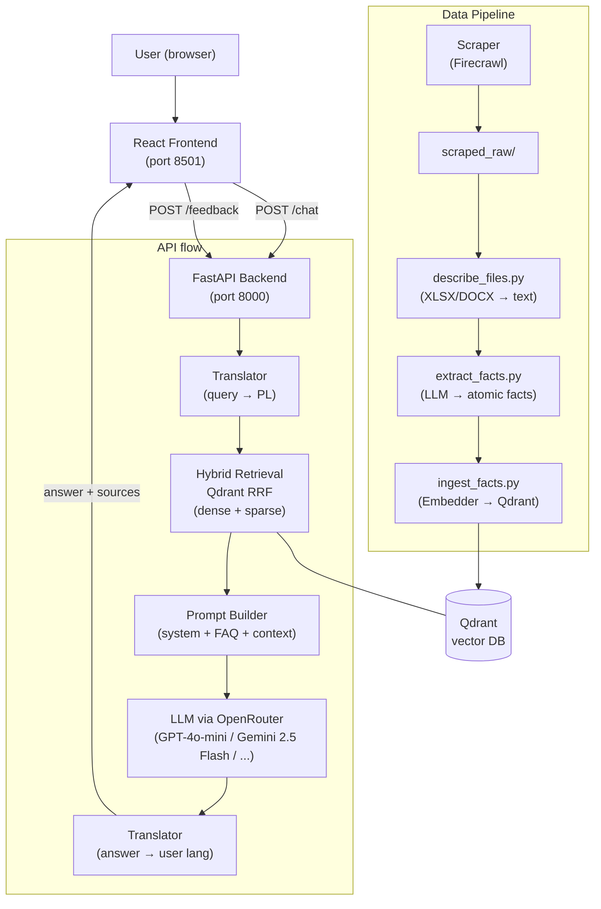

# MiNIonek — RAG Chatbot for Faculty of MiNI PW

A multilingual RAG-based chatbot for the Faculty of Mathematics and Information Science (MiNI) at Warsaw University of Technology. Answers student and staff questions about schedules, regulations, events, administrative procedures, and more.

**Languages supported:** Polish, English, Ukrainian

---

## System Architecture



**Data flow (query):**
1. User query → Frontend
2. API translates non-Polish queries to Polish
3. Hybrid retrieval: dense (sentence-transformers) + sparse (SPLADE) → RRF fusion in Qdrant
4. Top-K facts passed to prompt builder alongside conversation history and static FAQ
5. LLM generates a Polish answer via OpenRouter
6. Answer translated back to user's language if needed
7. Response + source URLs returned to frontend

**Data flow (ingestion):**
1. Firecrawl scrapes MiNI PW website (HTML + PDF)
2. XLSX/DOCX files processed by `describe_files.py`
3. LLM extracts atomic facts from each document
4. Facts embedded and stored in Qdrant with source URL metadata

---

## Repository Structure

```
Chatbot-MiNI/
├── src/
│   ├── api/                        # FastAPI server + query pipeline
│   │   ├── api.py                  # /chat and /feedback endpoints
│   │   ├── main.py                 # OpenRouter LLM client
│   │   ├── models.py               # Pydantic models (Message)
│   │   ├── retrieval.py            # Hybrid Qdrant retrieval (dense+sparse RRF)
│   │   ├── prompt_builder.py       # LLM prompt construction + per-role hints
│   │   ├── query_rewriter.py       # LLM-based query rewriting before retrieval
│   │   ├── translator.py           # Multi-language translation (PL/EN/UA)
│   │   ├── logs.py                 # Logging utilities
│   │   └── tests/
│   │       ├── api_test.py         # /chat, /feedback endpoint tests
│   │       └── main_test.py        # OpenRouter client tests
│   │
│   ├── ingestion/                  # Everything that builds the knowledge base
│   │   ├── common.py               # Pipeline version config (v1-v4), LLM client
│   │   ├── scraper.py              # Firecrawl-based web scraper (saves incrementally)
│   │   ├── describe_files.py       # XLSX/DOCX text extraction
│   │   ├── extract_facts.py        # LLM-based fact extraction (all facts, no selection)
│   │   ├── ingest_facts.py         # Embed facts + load into Qdrant (batched, resumable)
│   │   ├── ingest_manual_pdfs.py   # Convert manually downloaded PDFs → scraped_raw .txt
│   │   ├── progress.py             # Pipeline progress tracker (scraped/extracted/ingested)
│   │   ├── links_curated.py        # ~15 hand-picked URLs (v1–v2)
│   │   ├── links_extended.py       # Full URL list for MiNI PW website (v3+)
│   │   ├── embedder.py             # HuggingFace embedding wrapper (BAAI/bge-m3)
│   │   ├── vector_db.py            # Qdrant collection setup + write/read helpers
│   │   └── tests/
│   │       ├── scraper_test.py         # clean_headnote, clean_footnote, main()
│   │       ├── extract_facts_test.py   # placeholder
│   │       ├── ingest_facts_test.py    # placeholder
│   │       ├── describe_files_test.py  # placeholder
│   │       └── common_test.py          # placeholder
│   │
│   ├── manual_pdfs/                # Manually downloaded PDFs (git-tracked, BIP PW cookiewall)
│   │   ├── regulamin_studiow.pdf
│   │   ├── regulamin_swiadczen_2025_2026.pdf
│   │   └── *.pdf                   # 18 hash-named BIP PW documents
│   │
│   ├── evaluation/                 # All evaluation and benchmarking
│   │   ├── benchmark.py            # Main benchmark (Hit@k, MRR, MRRw, nDCG, MAP, P-R)
│   │   ├── benchmark_v1.py         # Legacy simple benchmark
│   │   ├── generate_golden_answers.py  # GPT-4o reference answers generator
│   │   ├── weighted_feedback.py    # Weighted aggregation of user feedback by role
│   │   ├── metrics.py              # BERTScore text metrics
│   │   ├── prepare_data.py         # CSV utilities for evaluation data
│   │   ├── eval_with_playwright.py # Playwright-based UI automation for answer collection
│   │   ├── llm_judge/
│   │   │   ├── judge.py            # LLM-as-a-judge (A/B, 1-5 scales)
│   │   │   └── testpro_runner.py   # Batch evaluation runner
│   │   ├── tests/
│   │   │   └── evaluation_test.py  # BERTScore metrics tests
│   │   └── data/
│   │       ├── questions.csv           # Raw student survey questions
│   │       ├── questions_cat.csv       # Questions with category labels
│   │       ├── questions_filtered.csv  # Filtered eval set with gold URLs
│   │       └── questions_with_links.csv # Full eval set with source links
│   │
│   ├── frontend/                   # React/Vite frontend
│   │   ├── src/
│   │   │   ├── App.jsx             # Main app (chat UI, A/B testing, role selection, feedback)
│   │   │   └── App.css
│   │   ├── vite.config.js          # Dev + preview proxy → api:8000 (Docker)
│   │   ├── Dockerfile
│   │   └── package.json
│   │
│   └── utils/
│       └── paths.py                # Path utilities
│
├── .github/workflows/
│   ├── deploy.yml                  # Manual deploy to self-hosted runner
│   ├── scrape_and_ingest.yml       # Manual: run scraper then full ingest pipeline
│   ├── ingest_only.yml             # Manual: run ingest only (skip scraping)
│   └── tests.yml                   # Manual: run test suite (workflow_dispatch only)
│
├── docker-compose.yml              # 5 services: scraper, ingest, api, frontend, tests
├── Dockerfile                      # Micromamba-based Python image
├── DEPLOYMENT.md                   # Step-by-step deployment & ingestion instructions
├── environment-linux.yml           # Conda env for Linux (deployment)
└── chatbot_mini.yml                # Conda env for Windows/Mac (local dev)
```

**Pipeline versions** (set via `PIPELINE_VERSION` env var):

| Version | URLs | Files | Chunking | LLM |
|---------|------|-------|----------|-----|
| 1 | 15 hand-picked | HTML + PDF | 1 file = 1 chunk | No |
| 2 | 15 hand-picked | HTML + PDF | 1 fact = 1 chunk | Yes |
| 3 | Full MiNI website | All (incl. XLSX/DOCX) | 1 fact = 1 chunk | Yes |
| 4 | All sources | All | 1 fact = 1 chunk | Yes |

---

## Local Setup

### Prerequisites

- [Conda](https://docs.conda.io/en/latest/) or [Miniconda](https://docs.conda.io/en/latest/miniconda.html)
- A `.env` file in the project root (see below)

### 1. Clone and create environment

```bash
git clone https://github.com/<your-fork>/Chatbot-MiNI
cd Chatbot-MiNI

# Windows / Mac
conda env create -f chatbot_mini.yml
conda activate chatbot_mini

# Linux
conda env create -f environment-linux.yml
conda activate chatbot_mini
```

### 2. Create `.env` file

```env
OPENROUTER_API_KEY=sk-or-...
FIRECRAWL_API_KEY=fc-...
PIPELINE_VERSION=2
MODEL_NAME=openai/gpt-4o-mini
QDRANT_DIR=src/data/qdrant_db
```

### 3. Run the ingestion pipeline (builds the vector DB)

```bash
# From repo root, with PYTHONPATH=src
export PYTHONPATH=src   # or set PYTHONPATH=src on Windows

python -m ingestion.scraper         # scrape pages → src/data/scraped_raw/
python -m ingestion.describe_files  # extract text from XLSX/DOCX (v3+)
python -m ingestion.extract_facts   # LLM fact extraction (v2+)
python -m ingestion.ingest_facts    # embed + load into Qdrant
```

For a quick local test with a small dataset, set `PIPELINE_VERSION=2` (15 URLs, fact-based).

### 4. Start the API

```bash
uvicorn api.api:app --reload --port 8000
```

### 5. Start the React frontend

```bash
cd src/frontend
npm install
npm run dev
# opens at http://localhost:5173
```

### 6. Or run everything with Docker Compose

```bash
docker compose up --build
```

---

## Running Evaluation

```bash
# Main benchmark (Hit@k, MRR, nDCG, MAP) — requires running API
python -m evaluation.benchmark

# LLM-as-a-judge batch evaluation
python -m evaluation.llm_judge.testpro_runner \
  --judge-model openai/gpt-4o \
  --limit 50
```

---

## Development

### Pre-commit hooks

```bash
pip install pre-commit
pre-commit install
```

Hooks: **Black** (formatting), **Ruff** (linting), **isort** (import sorting).

### Conventions

| Topic | Rule |
|-------|------|
| Language | All code, comments, commits, PRs in **English** |
| Commits | Conventional Commits: `Add X`, `Fix Y`, `Update Z` |
| Branches | `feature/*`, `fix/*`, `hotfix/*` — never push to `main` directly |
| Naming | `snake_case` functions/vars, `PascalCase` classes, `UPPER_SNAKE_CASE` constants |
| Docs | NumPy-style docstrings on every function and class |
| Logging | Use `logging` module, not `print` |
| PRs | At least 1 approved review before merge |

---

## Deployment

Deployment is triggered manually via GitHub Actions (`Actions → Deploy Chatbot MiNI → Run workflow`).
The self-hosted runner runs on a faculty VM accessible only from the faculty network.

**Never push deployment-breaking changes to `chatbot_v3` without testing locally first.**

See [DEPLOYMENT.md](DEPLOYMENT.md) for step-by-step manual deployment and ingestion instructions.
